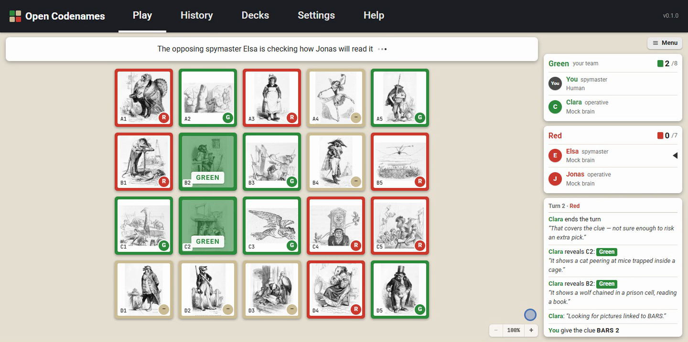

# Open Codenames

**Codenames with pictures, played with AI teammates and opponents.**

You and an AI teammate face two AI opponents on a board of pictures. Give one-word clues as the spymaster, or work out your teammate's clues as the operative. The AI players are language models that look at the pictures themselves, reason out loud in the game log, and never repeat a clue. A debrief after every game shows what each clue meant and what the AIs considered.



- **Desktop (Windows) and browser** versions.
- **Bring your own key:** Anthropic, OpenAI, Google, OpenRouter, xAI, Mistral, or a local model on the desktop. Keys stay with the player and go only to the provider they chose; there is no Open Codenames server.
- **Built-in picture deck:** 68 public-domain engravings by J. J. Grandville. The desktop version can also generate new pictures or use your own collections.

Player documentation: [`docs/README.md`](docs/README.md) (also shipped with the game).

## Build from source

Requires Node.js 22 or newer.

```sh
npm install
npm run dev        # desktop game with hot reload (debug build, offline mock AI available)
npm run dev:web    # browser version
npm test
```

See [CONTRIBUTING.md](CONTRIBUTING.md) to get involved and [SECURITY.md](SECURITY.md) to report a vulnerability.

## License

[MIT](LICENSE). The picture deck is public domain; fonts and bundled libraries are listed in [THIRD_PARTY_NOTICES.md](THIRD_PARTY_NOTICES.md).

“Codenames” is a registered trademark of Czech Games Edition. Open Codenames is an independent fan project and is not affiliated with or endorsed by Czech Games Edition.

---

# Developer guide

Electron + TypeScript + React, local-first. Player-facing docs live in [`docs/`](docs/) and ship with the build.

## Builds

Two flavors, fixed at build time by `OC_BUILD` (`src/shared/build.ts`):

- **Debug** (default for `dev`/`build`): includes the offline mock AI and placeholder image generator, shows a DEBUG badge, keeps its data in `%APPDATA%\Open Codenames Debug`.
- **Release** (`OC_BUILD=release`): no mock code at all. This is what ships on itch.io.

Two targets: **desktop** (Electron) and **web** (the same UI in a browser; `src/web` replaces the main process with an in-page bridge — settings, keys and history in local storage, the standard deck as static files, provider calls straight from the page; no picture generation, folders, imports or local models).

## Scripts

| Command | What it does |
|---|---|
| `npm run dev` | Run the desktop game (debug) with hot reload |
| `npm run dev:web` | Run the web version (debug) in a browser with hot reload |
| `npm test` | Unit tests (Vitest): rules, information boundaries, strategy, parsing, providers, credentials |
| `npm run typecheck` | Type-check main, preload, core, renderer and web |
| `npm run e2e` | Build (debug), then drive the desktop app with Playwright against the mock AI; screenshots go to `.e2e/` |
| `npm run e2e:web` | Build the debug web version, then drive it in headless Chrome; screenshots go to `.e2e-web/` |
| `npm run dist:debug` | Debug desktop build → `release/debug/win-unpacked/Open Codenames Debug.exe` |
| `npm run dist:release` | Release desktop build → `release/desktop/` (zip with `.itch.toml` and docs) |
| `npm run build:web` | Release web build → `out/web/` |
| `npm run dist:itch` | Both release builds, packaged for itch.io in `release/itch/` (Windows zip, web zip, `UPLOAD.txt`) |
| `npm run demos` | Record the two ~30 s demo videos (1920×1080 MP4, captioned) into `release/demos/`; needs ffmpeg and Chrome |
| `python -P scripts/deck/fetch_met.py`, `fetch_commons.py`, `survey.py`, `cut.py`, `build_deck.py` | Rebuild the standard deck from public-domain sources (selection and captions in `scripts/deck/selection.json`) |
| `npx tsx scripts/mock-sim.mts [games] [seed]` | Watch the offline mock AI play itself on standard-deck boards (clues, intended pictures, picks) |
| `Play Open Codenames.cmd` | Launch the debug desktop build |

If your shell sets `ELECTRON_RUN_AS_NODE=1` (VS Code’s terminal does), unset it before launching Electron directly.

## Architecture

```
src/
  core/       Pure TypeScript game logic — no Electron, React or vendor code.
    engine/     GameEngine (authoritative rules/state), views (information boundaries), MatchController (turn loop)
    rules/      IRuleSet + StandardRules
    board/      Layouts, concept bank, board generator (seeded)
    ai/         LLMPlayer, the AI profile, prompts, strategy (clue size, risk/reward, stopping), JSON parsing, mock brain
    players/    IPlayer, HumanPlayer (UI bridge)
    modes/      Game-mode registry (Quick Play, Standard, AI vs AI, coming-soon modes)
    replay/     GameRecord + recorder (debriefs, future replays / AI Arena)
    images/     Prompt construction and art styles
  shared/     Types shared by main and renderer: settings, provider catalog, IPC contract
  main/       Electron main process: the only place keys and network calls exist
    providers/llm/    ILLMProvider: anthropic (official SDK), openai (Responses API), google (Interactions API),
                      openaiCompatible (OpenRouter, xAI, Mistral, local), mock
    providers/image/  IImageGenerationProvider: stability, bfl, openaiImages, googleImages, replicate, a1111, mock
    images/           Image library (disk cache + player folder), thumbnails for vision, board image pipeline
    store/            Settings, CredentialStore (safeStorage/DPAPI), replays, diagnostics (redacting log)
  preload/    Typed contextBridge API (`window.oc`) — keys can be written but never read back
  renderer/   React UI: screens, board, player boards, game log, debrief
  web/        Browser version of the `window.oc` bridge (entry for the web build)
```

Dependency direction: `renderer` and `main` depend on `core`/`shared`; `core` depends on nothing app-specific.

### Information boundaries

`buildSpymasterView` and `buildOperativeView` (`src/core/engine/views.ts`) are the only way players see the game. `OperativeView` has no field that can carry the key, prompt builders accept only the view for their role, and `tests/boundaries.test.ts` checks non-interference: games that differ only in hidden identities produce byte-identical operative prompts. The UI renders the board from the human’s role view too.

### AI pipeline

Every AI seat is its own `LLMPlayer` with its own slot, RNG and memory, all playing the single profile in `src/core/ai/personalities.ts`. Players see the board pictures themselves (thumbnails); no view or prompt carries a text description of a picture, so only vision models can take a seat.

Spymaster: clue size — the human teammate picks it in the status bar before each clue (Auto or 1–4), otherwise `planClueSize` (opening 1/2/3 at 25/50/25%, then “stay ahead” of the opponents’ pace) → LLM proposes candidate clues with link strengths and risks → `evaluateCandidates` validates them against the real key, rejects any clue already given this game, and scores expected value → teammate simulation → clue. Operative: one LLM call per turn ranks guesses with confidences → `shouldTakeGuess` decides how far to go given the score.

### Extending

- **LLM provider**: implement `ILLMProvider` in `src/main/providers/llm/`, register it in `registry.ts`, add catalog data in `src/shared/providers.ts`.
- **Image provider**: implement `IImageGenerationProvider` in `src/main/providers/image/`, register it, add catalog data.
- **Game mode**: add a `GameModeDef` in `src/core/modes/gameModes.ts`.
- **Rule variant**: implement `IRuleSet` and pass it to `GameEngine`.

## Data locations

`%APPDATA%\Open Codenames` (Electron `userData`): `settings.json`, `credentials.json` (encrypted), `images/`, `replays/`, `logs/`. Set `OC_USER_DATA` to use a different folder (the e2e test does).
